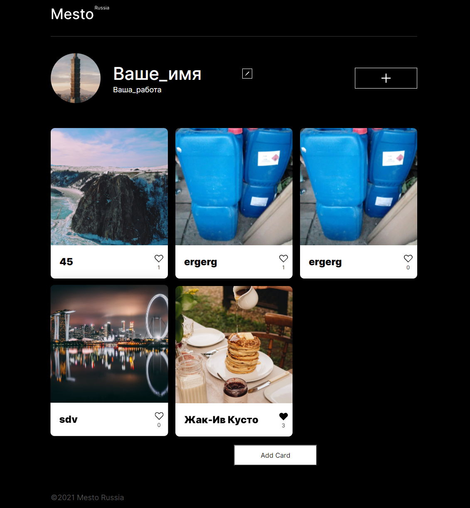

# Проект Mesto
[ссылка](https://interind.github.io/mesto/index.html)

**Описание:**
Проект на ООП где пользователи добавляют и удаляют изображения в реальном времени с использованием стороннего апи.

**Stack:**
HTML,
CSS,
JavaScript.

**Start project:**

Запуск `npm run build`  осуществит сборку статики проекта.
